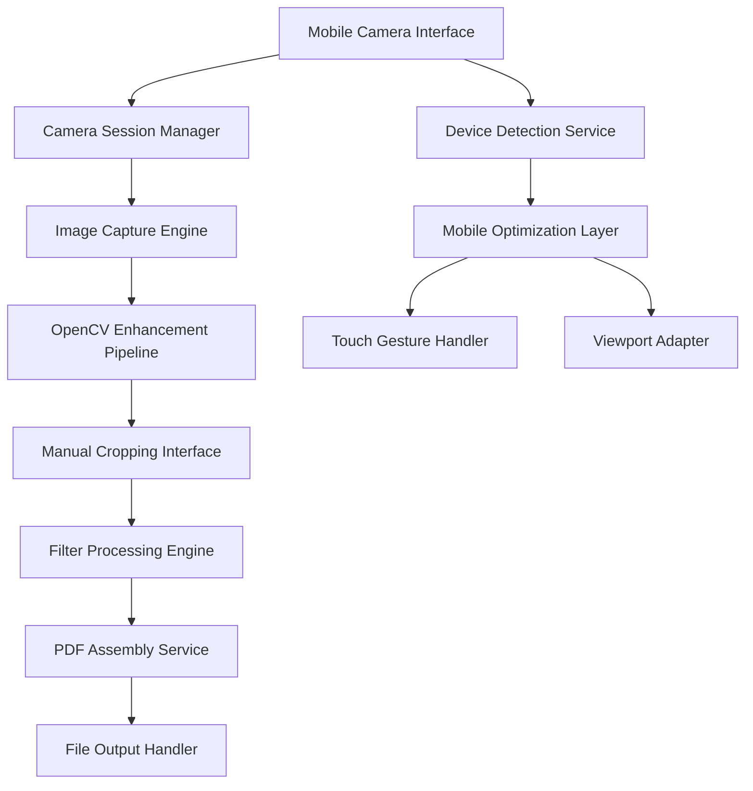

# Design Document

## Overview

This design outlines the mobile-optimized camera capture system that removes problematic edge detection while maintaining OpenCV image enhancement capabilities. The system focuses on manual cropping controls, professional filters, and fast PDF generation without compression delays.

## Architecture

### High-Level Architecture



### Component Hierarchy

```
ScannerModal (Enhanced)
├── MobileDetectionProvider
├── CameraSessionManager (Modified)
├── CaptureInterface (Simplified)
├── ManualCroppingEditor (New)
├── FilterProcessingPanel (Enhanced)
└── PDFAssemblyManager (Optimized)
```

## Components and Interfaces

### 1. Mobile Detection Service

**Purpose**: Detect mobile devices and disable problematic features

```typescript
interface MobileDetectionService {
  isMobileDevice(): boolean
  shouldDisableEdgeDetection(): boolean
  getOptimalCameraSettings(): CameraSettings
  getTouchCapabilities(): TouchCapabilities
}

interface CameraSettings {
  resolution: { width: number; height: number }
  frameRate: number
  facingMode: 'user' | 'environment'
}

interface TouchCapabilities {
  supportsPinchZoom: boolean
  supportsMultiTouch: boolean
  hasHapticFeedback: boolean
}
```

### 2. Enhanced Camera Session Manager

**Purpose**: Manage camera lifecycle with mobile optimizations

```typescript
interface EnhancedCameraSession extends CameraSession {
  mobileOptimizations: MobileOptimizations
  disableEdgeDetection(): void
  enableImageEnhancement(): void
  handleOrientationChange(): void
}

interface MobileOptimizations {
  touchFriendlyControls: boolean
  hapticFeedback: boolean
  batteryOptimization: boolean
  memoryManagement: boolean
}
```

### 3. Manual Cropping Interface

**Purpose**: Provide precise manual cropping with corner handles

```typescript
interface ManualCroppingEditor {
  corners: CropCorner[]
  cropArea: CropArea
  previewCanvas: HTMLCanvasElement
  
  initializeCropping(image: ImageData): void
  updateCorner(cornerId: string, position: Point): void
  applyPerspectiveCorrection(): Promise<string>
  resetToDefaults(): void
}

interface CropCorner {
  id: string
  position: Point
  isDragging: boolean
  touchRadius: number
}

interface CropArea {
  topLeft: Point
  topRight: Point
  bottomLeft: Point
  bottomRight: Point
  isValid: boolean
}
```

### 4. Enhanced Filter System

**Purpose**: Professional document filters optimized for mobile

```typescript
interface FilterProcessingEngine {
  availableFilters: DocumentFilter[]
  currentFilter: string
  
  applyFilter(imageData: string, filter: DocumentFilter): Promise<string>
  previewFilter(filter: DocumentFilter): void
  resetFilters(): void
}

interface DocumentFilter {
  id: string
  name: string
  description: string
  mobileOptimized: boolean
  processingTime: 'fast' | 'medium' | 'slow'
  
  apply(imageData: ImageData): Promise<ImageData>
}
```

### 5. Optimized PDF Assembly

**Purpose**: Fast PDF generation without compression

```typescript
interface OptimizedPDFAssembler {
  compressionEnabled: boolean
  qualitySettings: PDFQualitySettings
  
  generatePDF(pages: ProcessedPage[]): Promise<File>
  estimateFileSize(pages: ProcessedPage[]): number
  getGenerationProgress(): number
}

interface PDFQualitySettings {
  imageQuality: number // 0.8-1.0 for mobile optimization
  compression: 'none' | 'minimal'
  colorSpace: 'RGB' | 'Grayscale'
}
```

## Data Models

### Enhanced Scanner State

```typescript
interface MobileScannerState extends ScannerState {
  // Mobile-specific state
  isMobileDevice: boolean
  edgeDetectionDisabled: boolean
  touchGesturesEnabled: boolean
  
  // Manual cropping state
  manualCroppingActive: boolean
  cropCorners: CropCorner[]
  cropPreview: string | null
  
  // Filter state
  availableFilters: DocumentFilter[]
  filterPreview: string | null
  
  // PDF generation state
  pdfGenerationProgress: number
  estimatedFileSize: number
}
```

### Processed Page Model

```typescript
interface ProcessedPage extends ScannerPage {
  // Enhanced processing metadata
  processingMetadata: ProcessingMetadata
  mobileOptimizations: MobileProcessingOptions
  
  // Manual cropping data
  manualCropData: ManualCropData | null
  
  // Filter application
  appliedFilters: AppliedFilter[]
}

interface ProcessingMetadata {
  captureDevice: 'mobile' | 'desktop'
  processingTime: number
  imageEnhancementApplied: boolean
  edgeDetectionSkipped: boolean
}

interface ManualCropData {
  originalCorners: CropCorner[]
  adjustedCorners: CropCorner[]
  perspectiveCorrectionApplied: boolean
}
```

## Error Handling

### Mobile-Specific Error Scenarios

1. **Camera Access Denied**
   - Fallback to file upload
   - Clear user guidance for permissions

2. **OpenCV Loading Failure**
   - Graceful degradation to basic processing
   - User notification with retry option

3. **Memory Constraints**
   - Automatic image resolution reduction
   - Progressive processing for large documents

4. **Touch Gesture Conflicts**
   - Gesture disambiguation
   - Visual feedback for active gestures

### Error Recovery Strategies

```typescript
interface ErrorRecoveryManager {
  handleCameraError(error: CameraError): RecoveryAction
  handleProcessingError(error: ProcessingError): RecoveryAction
  handleMemoryError(error: MemoryError): RecoveryAction
}

type RecoveryAction = 
  | { type: 'retry'; delay: number }
  | { type: 'fallback'; alternative: string }
  | { type: 'degrade'; reducedFeatures: string[] }
  | { type: 'abort'; userMessage: string }
```

## Testing Strategy

### Mobile Testing Approach

1. **Device Testing Matrix**
   - iOS Safari (iPhone 12+, iPad)
   - Android Chrome (Samsung, Pixel)
   - Various screen sizes and orientations

2. **Performance Testing**
   - Memory usage monitoring
   - Battery consumption analysis
   - Processing time benchmarks

3. **Touch Interaction Testing**
   - Gesture recognition accuracy
   - Touch target accessibility
   - Multi-touch conflict resolution

4. **Image Quality Testing**
   - Various lighting conditions
   - Different document types
   - Filter effectiveness validation

### Test Scenarios

```typescript
interface MobileTestScenarios {
  cameraCapture: {
    lowLight: boolean
    handShake: boolean
    orientationChanges: boolean
  }
  
  manualCropping: {
    precisionTesting: boolean
    gestureConflicts: boolean
    cornerAdjustment: boolean
  }
  
  filterApplication: {
    processingSpeed: boolean
    qualityPreservation: boolean
    memoryUsage: boolean
  }
  
  pdfGeneration: {
    largeDocuments: boolean
    multiplePages: boolean
    generationSpeed: boolean
  }
}
```

## Implementation Phases

### Phase 1: Mobile Detection & Edge Detection Removal
- Implement device detection service
- Disable edge detection for mobile devices
- Maintain OpenCV image enhancement
- Update camera session management

### Phase 2: Manual Cropping Interface
- Create touch-friendly cropping interface
- Implement corner handle system
- Add perspective correction
- Integrate with existing workflow

### Phase 3: Enhanced Filter System
- Develop professional document filters
- Optimize for mobile performance
- Add real-time preview capabilities
- Implement filter persistence

### Phase 4: PDF Generation Optimization
- Remove compression for speed
- Optimize memory usage
- Add progress indicators
- Implement error recovery

## Performance Considerations

### Mobile Optimization Strategies

1. **Memory Management**
   - Canvas recycling for image processing
   - Lazy loading of OpenCV modules
   - Automatic garbage collection triggers

2. **Processing Optimization**
   - Web Workers for heavy computations
   - Progressive image enhancement
   - Batch processing for multiple pages

3. **Battery Conservation**
   - Reduced camera frame rate during idle
   - Efficient touch event handling
   - Minimal background processing

4. **Network Optimization**
   - Local PDF generation (no server uploads)
   - Compressed OpenCV library loading
   - Cached filter presets

## Security Considerations

### Privacy Protection
- All processing happens client-side
- No image data transmitted to servers
- Local storage encryption for temporary files
- Automatic cleanup of processed images

### Data Integrity
- Checksum validation for processed images
- Secure PDF generation without data leaks
- Protected memory allocation for sensitive operations