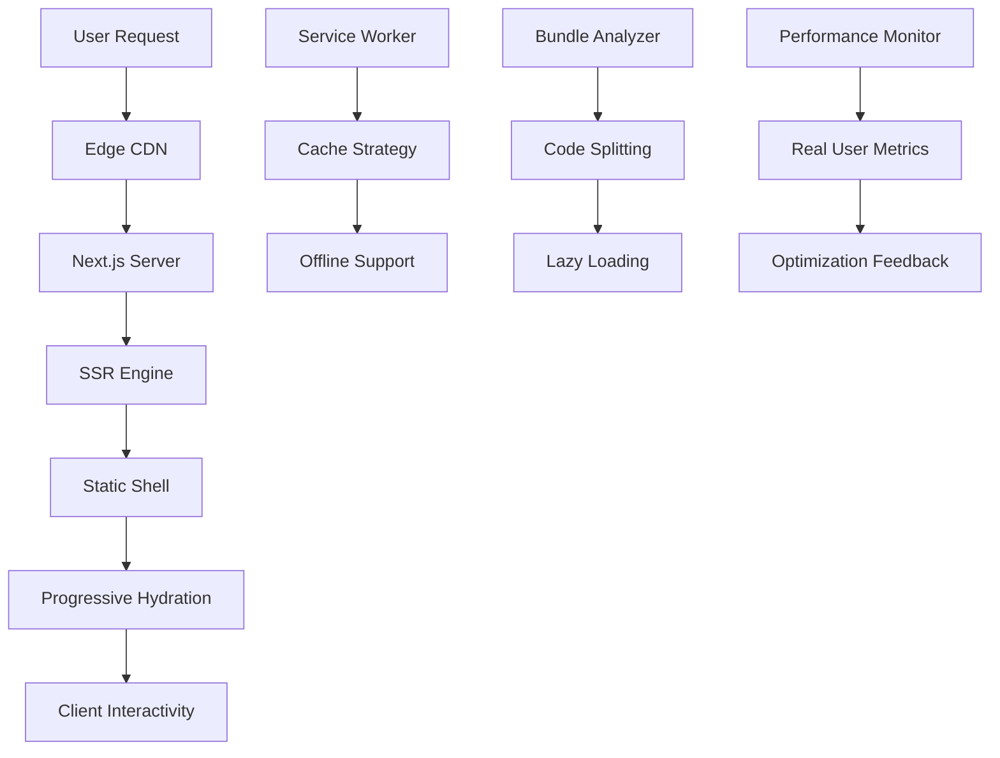

# Mobile Performance Optimization Design

## Overview

This design document outlines the technical architecture and implementation strategy for optimizing the UOLINK web application for mobile devices. The solution focuses on implementing server-side rendering, improving performance for small screens, and optimizing for low internet connections while maintaining the existing functionality.

## Architecture

### Current State Analysis

**Critical Issues Identified:**
- 95% of components use 'use client' directive, preventing SSR
- Large JavaScript bundles (>500KB initial load)
- No progressive loading or code splitting
- Limited mobile-specific optimizations outside scanner component
- Heavy client-side rendering causing poor Core Web Vitals
- No service worker or offline capabilities

### Target Architecture



## Components and Interfaces

### 1. Server-Side Rendering Layer

**SSR Configuration**
```typescript
// next.config.js enhancements
const nextConfig = {
  experimental: {
    ppr: true, // Partial Prerendering
    serverComponentsExternalPackages: ['firebase-admin']
  },
  compiler: {
    removeConsole: process.env.NODE_ENV === 'production'
  },
  images: {
    formats: ['image/avif', 'image/webp'],
    deviceSizes: [640, 750, 828, 1080, 1200],
    imageSizes: [16, 32, 48, 64, 96, 128, 256, 384]
  }
}
```

**Component Conversion Strategy**
- Convert layout components to Server Components
- Implement client boundaries for interactive features
- Use React 18 Suspense for progressive loading

### 2. Performance Optimization Layer

**Bundle Splitting Architecture**
```typescript
// Dynamic imports for code splitting
const DashboardRefactored = dynamic(() => import('./DashboardRefactored'), {
  loading: () => <DashboardSkeleton />,
  ssr: false
})

const ScannerModal = dynamic(() => import('./scanner/ScannerModal'), {
  loading: () => <ScannerSkeleton />
})
```

**Image Optimization Pipeline**
```typescript
interface OptimizedImageProps {
  src: string
  alt: string
  priority?: boolean
  sizes: string
  quality?: number
}

// Responsive image component with WebP/AVIF support
const OptimizedImage: React.FC<OptimizedImageProps>
```

### 3. Caching and Network Layer

**Service Worker Strategy**
```typescript
// Cache-first for static assets
// Network-first for API calls
// Stale-while-revalidate for images

interface CacheStrategy {
  static: 'cache-first'
  api: 'network-first'
  images: 'stale-while-revalidate'
  documents: 'cache-first'
}
```

**Request Optimization**
```typescript
// Request deduplication and batching
class RequestManager {
  private pendingRequests: Map<string, Promise<any>>
  
  async dedupedFetch(url: string, options?: RequestInit): Promise<Response>
  async batchRequests(requests: BatchRequest[]): Promise<BatchResponse[]>
}
```

### 4. Mobile UI Optimization Layer

**Responsive Layout System**
```typescript
interface MobileLayoutProps {
  children: React.ReactNode
  orientation: 'portrait' | 'landscape'
  viewport: ViewportSize
}

// Adaptive layout based on device capabilities
const MobileLayout: React.FC<MobileLayoutProps>
```

**Touch Interaction Manager**
```typescript
interface TouchGesture {
  type: 'tap' | 'swipe' | 'pinch' | 'long-press'
  direction?: 'left' | 'right' | 'up' | 'down'
  callback: (event: TouchEvent) => void
}

class GestureManager {
  registerGesture(element: HTMLElement, gesture: TouchGesture): void
  unregisterGesture(element: HTMLElement): void
}
```

## Data Models

### Performance Metrics Model
```typescript
interface PerformanceMetrics {
  lcp: number // Largest Contentful Paint
  fid: number // First Input Delay
  cls: number // Cumulative Layout Shift
  ttfb: number // Time to First Byte
  fcp: number // First Contentful Paint
  deviceType: 'mobile' | 'tablet' | 'desktop'
  connectionType: 'slow-2g' | '2g' | '3g' | '4g' | '5g'
  timestamp: Date
}
```

### Cache Configuration Model
```typescript
interface CacheConfig {
  version: string
  staticAssets: {
    cacheName: string
    urls: string[]
    maxAge: number
  }
  dynamicContent: {
    cacheName: string
    strategy: CacheStrategy
    maxEntries: number
  }
  apiResponses: {
    cacheName: string
    patterns: RegExp[]
    networkTimeoutSeconds: number
  }
}
```

### Mobile Optimization Settings
```typescript
interface MobileSettings {
  enableServiceWorker: boolean
  enableOfflineMode: boolean
  imageQuality: 'low' | 'medium' | 'high' | 'auto'
  enableHapticFeedback: boolean
  enableGestures: boolean
  adaptiveLoading: boolean
  connectionAware: boolean
}
```

## Error Handling

### Progressive Enhancement Strategy
```typescript
// Graceful degradation for unsupported features
class FeatureDetection {
  static supportsServiceWorker(): boolean
  static supportsWebP(): boolean
  static supportsAVIF(): boolean
  static supportsIntersectionObserver(): boolean
  static supportsNetworkInformation(): boolean
}

// Fallback mechanisms
interface FallbackStrategy {
  serviceWorker: () => void // Use memory cache
  webp: () => void // Use JPEG
  intersectionObserver: () => void // Use scroll events
}
```

### Error Boundaries for Mobile
```typescript
class MobileErrorBoundary extends React.Component {
  // Enhanced error reporting for mobile-specific issues
  // Network connectivity errors
  // Touch interaction failures
  // Performance degradation alerts
}
```

## Testing Strategy

### Performance Testing Framework
```typescript
interface PerformanceTest {
  name: string
  device: 'mobile' | 'tablet'
  network: '3g' | '4g' | 'wifi'
  metrics: PerformanceMetrics
  threshold: PerformanceThreshold
}

interface PerformanceThreshold {
  lcp: number // < 2.5s
  fid: number // < 100ms
  cls: number // < 0.1
}
```

### Mobile Testing Suite
- Lighthouse CI integration
- Real device testing with BrowserStack
- Network throttling tests
- Touch interaction tests
- Offline functionality tests

### A/B Testing Framework
```typescript
interface ExperimentConfig {
  name: string
  variants: {
    control: ComponentVariant
    treatment: ComponentVariant
  }
  metrics: string[]
  trafficAllocation: number
}
```

## Implementation Phases

### Phase 1: SSR Foundation (Week 1-2)
- Convert layout components to Server Components
- Implement progressive hydration
- Set up performance monitoring

### Phase 2: Bundle Optimization (Week 2-3)
- Implement code splitting
- Add lazy loading for non-critical components
- Optimize image delivery

### Phase 3: Caching Layer (Week 3-4)
- Implement service worker
- Set up cache strategies
- Add offline functionality

### Phase 4: Mobile UX (Week 4-5)
- Enhance touch interactions
- Implement adaptive loading
- Add PWA features

### Phase 5: Monitoring & Optimization (Week 5-6)
- Deploy performance monitoring
- Implement A/B testing
- Fine-tune based on real user data

## Performance Targets

### Core Web Vitals Goals
- **LCP**: < 2.5 seconds (currently ~4-5s)
- **FID**: < 100ms (currently ~200-300ms)
- **CLS**: < 0.1 (currently ~0.2-0.3)

### Bundle Size Targets
- **Initial JS**: < 200KB (currently ~500KB)
- **Total JS**: < 1MB (currently ~2MB+)
- **Images**: 50% size reduction with modern formats

### Network Optimization
- **Cache Hit Rate**: > 80%
- **Offline Functionality**: 90% of core features
- **Request Reduction**: 40% fewer API calls through batching

This design provides a comprehensive approach to mobile optimization while maintaining the existing functionality and user experience of the UOLINK platform.