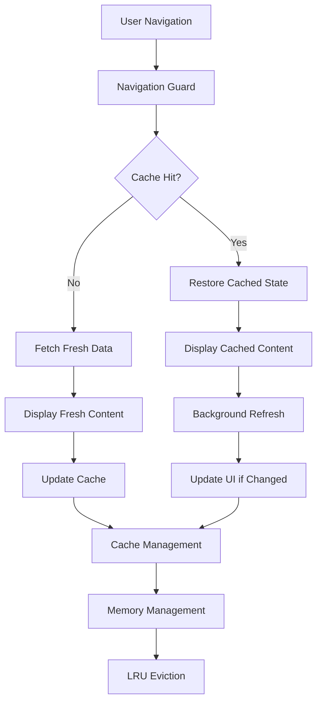
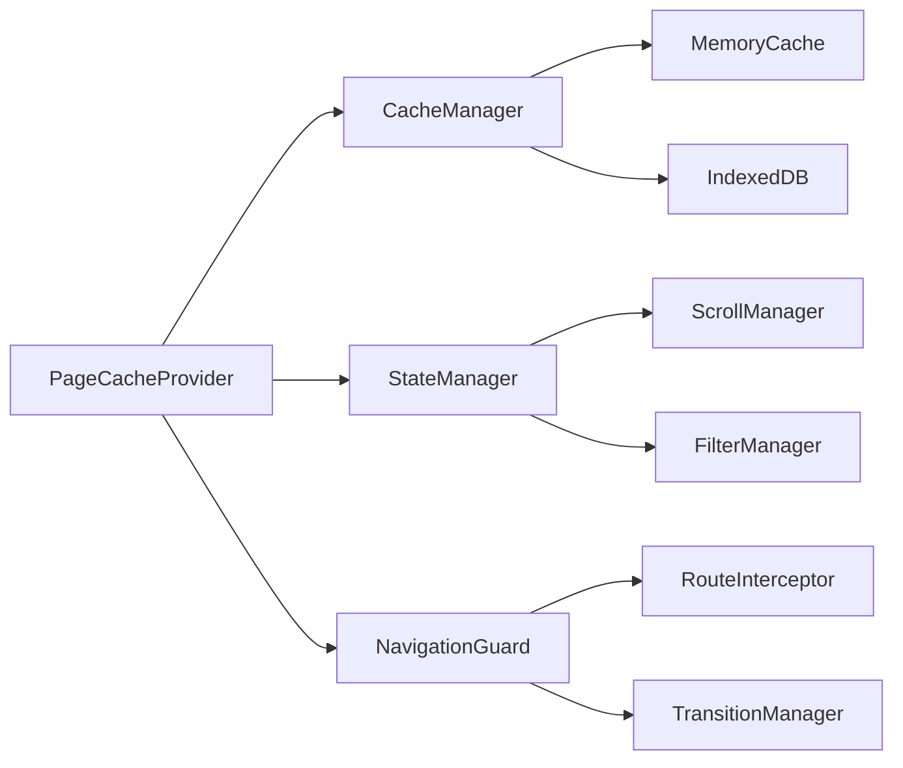

# PWA Page Caching System Design

## Overview

The PWA Page Caching System transforms the UoLink application from a traditional multi-page app into a responsive single-page application experience. The system implements intelligent client-side caching, state persistence, and background refresh strategies to eliminate page reloads and provide native app-like navigation performance.

The solution consists of three main layers:
1. **Cache Management Layer**: Handles data storage, retrieval, and lifecycle management
2. **State Persistence Layer**: Preserves UI state, scroll positions, and user interactions
3. **Navigation Enhancement Layer**: Intercepts navigation and provides seamless transitions

## Architecture

### High-Level Architecture



### Component Architecture



## Components and Interfaces

### Core Interfaces

```typescript
interface PageCacheEntry {
  id: string
  route: string
  data: any
  state: PageState
  timestamp: number
  lastAccessed: number
  priority: CachePriority
  size: number
}

interface PageState {
  scrollPosition: number
  filters: Record<string, any>
  expandedSections: string[]
  searchTerm: string
  selectedItems: string[]
  formData: Record<string, any>
}

interface CacheConfig {
  maxSize: number // 50MB
  maxAge: number // 30 minutes
  backgroundRefreshThreshold: number // 5 minutes
  priorityWeights: PriorityWeights
}

interface BackgroundRefreshStrategy {
  shouldRefresh(entry: PageCacheEntry): boolean
  scheduleRefresh(route: string): void
  handleRefreshResult(route: string, data: any): void
}
```

### Cache Manager

The Cache Manager handles all cache operations with intelligent memory management:

```typescript
class CacheManager {
  private memoryCache: Map<string, PageCacheEntry>
  private persistentCache: IDBDatabase
  private config: CacheConfig
  
  async get(route: string): Promise<PageCacheEntry | null>
  async set(route: string, data: any, state: PageState): Promise<void>
  async invalidate(route: string): Promise<void>
  async cleanup(): Promise<void>
  private calculatePriority(entry: PageCacheEntry): number
  private evictLRU(): Promise<void>
}
```

### State Manager

Manages UI state persistence across navigation:

```typescript
class StateManager {
  private stateStore: Map<string, PageState>
  
  captureState(route: string): PageState
  restoreState(route: string, state: PageState): void
  private captureScrollPosition(): number
  private captureFilters(): Record<string, any>
  private captureFormData(): Record<string, any>
}
```

### Navigation Guard

Intercepts navigation to implement cache-first loading:

```typescript
class NavigationGuard {
  private cacheManager: CacheManager
  private stateManager: StateManager
  
  async handleNavigation(to: string, from: string): Promise<void>
  private shouldUseCache(entry: PageCacheEntry): boolean
  private scheduleBackgroundRefresh(route: string): void
}
```

## Data Models

### Cache Entry Structure

```typescript
interface CacheEntry {
  // Identification
  id: string
  route: string
  
  // Data payload
  data: {
    notes?: Note[]
    profile?: ProfileData
    timetable?: TimetableData
    metadata: {
      totalCount: number
      hasMore: boolean
      lastDocSnapshot: any
    }
  }
  
  // UI State
  state: {
    scrollPosition: number
    filters: {
      titleFilter: string
      semesterFilter: string
      subjectFilter: string
      // ... other filters
    }
    expandedSections: string[]
    selectedItems: string[]
    searchTerm: string
    sortMode: string
  }
  
  // Cache metadata
  timestamp: number
  lastAccessed: number
  accessCount: number
  priority: 'high' | 'medium' | 'low'
  size: number
  version: string
}
```

### Priority Calculation

```typescript
enum CachePriority {
  HIGH = 3,    // Dashboard, current user profile
  MEDIUM = 2,  // Recently visited pages, search results
  LOW = 1      // Infrequently accessed pages
}

interface PriorityWeights {
  recency: number      // 0.4 - How recently accessed
  frequency: number    // 0.3 - How often accessed
  userGenerated: number // 0.2 - Contains user data
  pageType: number     // 0.1 - Type of page (dashboard > profile > others)
}
```

## Correctness Properties

*A property is a characteristic or behavior that should hold true across all valid executions of a system-essentially, a formal statement about what the system should do. Properties serve as the bridge between human-readable specifications and machine-verifiable correctness guarantees.*

Property 1: Cache hit provides immediate content display
*For any* previously visited page route, navigating to that route should display cached content immediately without showing loading indicators
**Validates: Requirements 1.1**

Property 2: Navigation preserves page state
*For any* navigation between dashboard, timetable, and profile pages, scroll positions and filter states should be preserved across the navigation
**Validates: Requirements 1.2**

Property 3: Dashboard state persistence
*For any* dashboard state (notes and filters), navigating away and returning should restore the exact same state
**Validates: Requirements 1.3**

Property 4: Background refresh for stale data
*For any* cached data older than 5 minutes, displaying that data should trigger a background refresh while showing the cached content
**Validates: Requirements 1.4**

Property 5: Filter preservation across navigation
*For any* set of applied filters on the dashboard, navigating away and returning should preserve all filter selections
**Validates: Requirements 2.1**

Property 6: Scroll position memory
*For any* scroll position on any page, navigating away and returning should restore the exact scroll position
**Validates: Requirements 2.2**

Property 7: Combined state restoration
*For any* filtered view with a scroll position, returning to that view should restore both the filtered results and the scroll position
**Validates: Requirements 2.3**

Property 8: UI element state preservation
*For any* combination of expanded or collapsed UI elements, navigating away and returning should maintain those exact states
**Validates: Requirements 2.4**

Property 9: Search text preservation
*For any* search text entered in search fields, navigating away and returning should preserve the search text
**Validates: Requirements 2.5**

Property 10: Cache size management
*For any* cache that reaches 50MB in size, the system should automatically remove least recently used pages
**Validates: Requirements 3.1**

Property 11: Memory pressure response
*For any* low memory condition, the system should reduce cache size by 50% using LRU eviction
**Validates: Requirements 3.2**

Property 12: Stale cache marking
*For any* page not visited for 30 minutes, the system should mark that page's cache as eligible for cleanup
**Validates: Requirements 3.3**

Property 13: Priority-based cache retention
*For any* memory pressure situation, the system should prioritize keeping the current page and most recent 2 pages in cache
**Validates: Requirements 3.4**

Property 14: Critical data preservation during cleanup
*For any* cache cleanup operation, user input states and critical navigation data should be preserved
**Validates: Requirements 3.5**

Property 15: Background refresh initiation
*For any* cached data being displayed, the system should initiate background refresh for updated content
**Validates: Requirements 4.1**

Property 16: Seamless cache updates
*For any* background refresh that completes with new data, the system should update the cached content seamlessly
**Validates: Requirements 4.2**

Property 17: Retry with exponential backoff
*For any* failed background refresh, the system should retry with exponential backoff up to 3 attempts
**Validates: Requirements 4.4**

Property 18: Deferred updates during interaction
*For any* active user interaction with a page, the system should defer background updates until interaction pauses
**Validates: Requirements 4.5**

Property 19: Cache-first data fetching
*For any* component data request, the system should check cache first before making network requests
**Validates: Requirements 5.2**

Property 20: Transparent fallback on cache miss
*For any* cache miss, the system should fallback to existing data fetching logic transparently
**Validates: Requirements 5.3**

Property 21: Context notification on cache population
*For any* cache population event, the system should notify existing contexts to update their state
**Validates: Requirements 5.4**

Property 22: Graceful error handling
*For any* caching error, the system should gracefully fallback to normal operation without breaking functionality
**Validates: Requirements 5.5**

Property 23: Offline cached page serving
*For any* offline condition, the system should continue serving cached pages without error messages
**Validates: Requirements 6.1**

Property 24: Offline uncached page handling
*For any* navigation to uncached pages while offline, the system should display appropriate offline messaging
**Validates: Requirements 6.2**

Property 25: Online refresh of stale data
*For any* transition from offline to online, the system should automatically refresh stale cached data
**Validates: Requirements 6.3**

Property 26: Cache integrity during extended offline
*For any* extended offline period, the system should preserve cache integrity and prevent corruption
**Validates: Requirements 6.4**

Property 27: Storage quota management
*For any* storage quota exceeded condition, the system should manage cache size while maintaining offline functionality
**Validates: Requirements 6.5**

Property 28: Consistent component lifecycle during cache restoration
*For any* cache restoration operation, the system should maintain consistent component mounting and unmounting behavior
**Validates: Requirements 7.3**

Property 29: Browser navigation state restoration
*For any* browser back/forward navigation, the system should restore cached state identically to programmatic navigation
**Validates: Requirements 7.5**

Property 30: Page type prioritization
*For any* multiple cached pages, the system should prioritize dashboard and profile pages over less frequently accessed pages
**Validates: Requirements 8.1**

Property 31: User content prioritization
*For any* limited cache space condition, the system should preserve user-generated content and personalized data over generic content
**Validates: Requirements 8.2**

Property 32: Priority calculation with frequency and recency
*For any* cache priority determination, the system should consider page visit frequency and recency in the calculation
**Validates: Requirements 8.3**

Property 33: Adaptive priority based on usage patterns
*For any* change in user patterns, the system should adapt cache priorities based on new usage patterns
**Validates: Requirements 8.4**

Property 34: Critical data protection under memory pressure
*For any* memory pressure scenario where critical user data is at risk, the system should protect it from cache eviction
**Validates: Requirements 8.5**

## Error Handling

### Cache Corruption Recovery

The system implements multiple layers of error recovery:

1. **Checksum Validation**: Each cache entry includes a checksum to detect corruption
2. **Graceful Degradation**: On cache errors, fall back to network requests
3. **Automatic Cleanup**: Corrupted entries are automatically removed and replaced
4. **State Recovery**: Critical UI state is backed up to localStorage as fallback

### Memory Management Errors

```typescript
interface MemoryErrorHandler {
  handleQuotaExceeded(): Promise<void>
  handleMemoryPressure(): Promise<void>
  emergencyCleanup(): Promise<void>
}
```

### Network Failure Handling

- Background refresh failures are retried with exponential backoff
- Offline detection triggers cache-only mode
- Network recovery automatically resumes background updates

## Testing Strategy

### Dual Testing Approach

The system requires both unit testing and property-based testing:

**Unit Tests:**
- Test specific cache operations (get, set, evict)
- Test state capture and restoration for known scenarios
- Test error handling with mocked failures
- Test integration points with existing contexts

**Property-Based Tests:**
- Use **fast-check** library for JavaScript property-based testing
- Configure each property test to run minimum 100 iterations
- Test universal properties across all possible inputs
- Verify cache behavior under various memory conditions

**Property-Based Testing Requirements:**
- Each correctness property must be implemented by a single property-based test
- Each test must be tagged with: **Feature: pwa-page-caching, Property {number}: {property_text}**
- Tests must generate random page states, navigation patterns, and cache conditions
- Memory pressure and offline scenarios must be simulated in tests

### Test Categories

1. **Cache Behavior Tests**: Verify cache hit/miss, eviction, and cleanup
2. **State Persistence Tests**: Verify UI state preservation across navigation
3. **Memory Management Tests**: Verify LRU eviction and memory pressure handling
4. **Background Refresh Tests**: Verify refresh timing and retry logic
5. **Offline Behavior Tests**: Verify offline functionality and recovery
6. **Integration Tests**: Verify compatibility with existing contexts

### Performance Testing

- Cache operations must complete within 50ms
- State restoration must complete within 100ms
- Memory usage must not exceed configured limits
- Background refresh must not block UI interactions

## Implementation Considerations

### Browser Compatibility

- IndexedDB for persistent storage (supported in all modern browsers)
- Memory API for memory pressure detection (with fallbacks)
- Intersection Observer for scroll position tracking
- Service Worker integration for offline support

### Performance Optimizations

- Lazy loading of cache entries
- Debounced state capture during rapid interactions
- Compressed storage for large data sets
- Background cleanup during idle time

### Security Considerations

- Cache entries are scoped to the current user session
- Sensitive data is excluded from persistent cache
- Cache cleanup on logout/session expiry
- CSRF protection for background refresh requests

### Migration Strategy

- Gradual rollout with feature flags
- Backward compatibility with existing data fetching
- Monitoring and rollback capabilities
- User preference for cache behavior